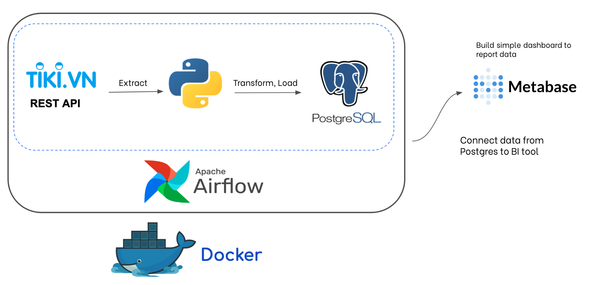
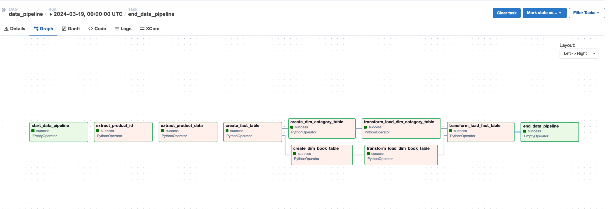
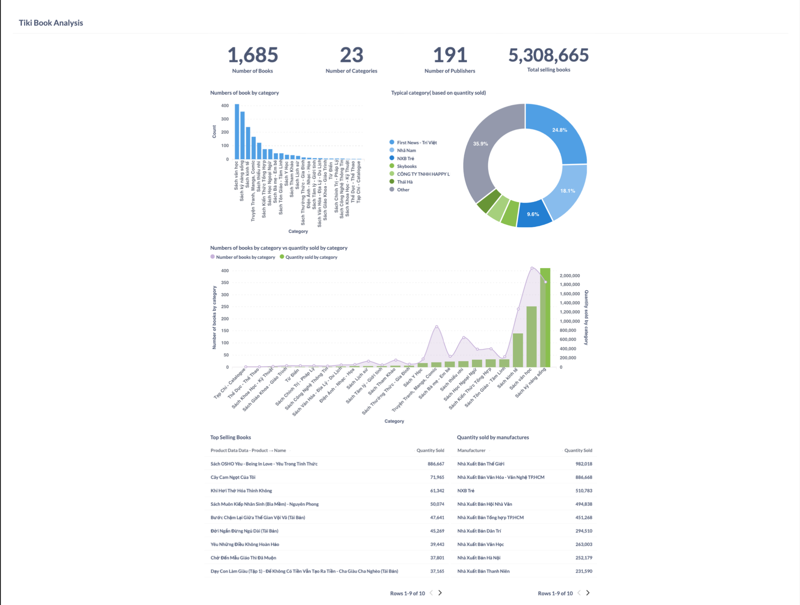

# TIKI BOOKS DATA PIPELINE WITH AIRFLOW

> A ETL data pipeline with Airflow, PostgreSQL, Docker, Python, Metabase.

## Project Overview

### Description

 Our Tiki Books Data Pipeline, powered by Apache Airflow, swiftly extracts and visualizes vital data from the Tiki API. Tailored for analysts, it translates raw data into actionable business insights, facilitating informed decisions and strategic planning.
### Tech Stacks
- OS: `macOS Sonoma `
- Containerization: `Docker `
- Automate Data Pipelines: `Airflow 2.8.0`
- Staging Database: `PostgreSQL 16.1`

- Building Dashboad: `MetaBase`
- Language: `Python 3.12`

### Data Platform Architecture

    

### Data pipeline

    

## Project Results

### Report Dashboard

Data in data PostgreSQL is used to make a simple dashboard in Metabase as shown in the image

    

